
<h1 align="center">智能交互式在线网上花店的研发+vue</h1>

## 简介
智能交互式在线网上花店：角色分为管理员、用户，包含鲜花展示、留言板、购物车、个人中心及后台管理等功能模块，支持订单管理和用户评价。    --计算机毕业设计源码；毕设源码；java毕业设计源码

## 联系方式

<h3 align="center">获取完整代码与数据库文件 + 微信：deepguan QQ: 86050149 QQ群: 783742310</h3>

<h3 align="center">可帮忙远程部署 包运行成功！提供远程部署、修改代码、设计文档指导、代码讲解等服务！</h3>

## 功能介绍（完整见运行截图）
管理员：基本功能包括登录、注册、退出和系统管理，提供鲜花管理、订单管理、用户管理、留言管理、鲜花类型管理等模块。后台界面支持查看、编辑、删除和上下架鲜花，管理用户订单详情、地址和支付信息，支持鲜花评价的管理与回复，并提供数据查询和统计功能。

用户：基本功能涵盖登录、注册、退出及游客访问，主页提供鲜花展示、分类搜索、留言功能、购物车管理及在线支付支持。个人中心包含个人信息的查看与修改，支持地址管理、订单查询和收藏管理，用户可通过留言板互动并提交评价。

访客：无需登录即可浏览鲜花分类和商品详情，通过主页的导航栏快速访问留言板和购物车功能。访客可以选择使用游客模式购买商品或进行充值，但无法访问个人中心的订单与地址管理功能。

鲜花商家：提供鲜花种类的分类管理，支持上传图片、填写库存与价格，方便维护鲜花信息。商家可通过系统查看销售数据，管理用户评价，改进服务质量，同时支持对订单进行发货和退款操作。

## 运行截图
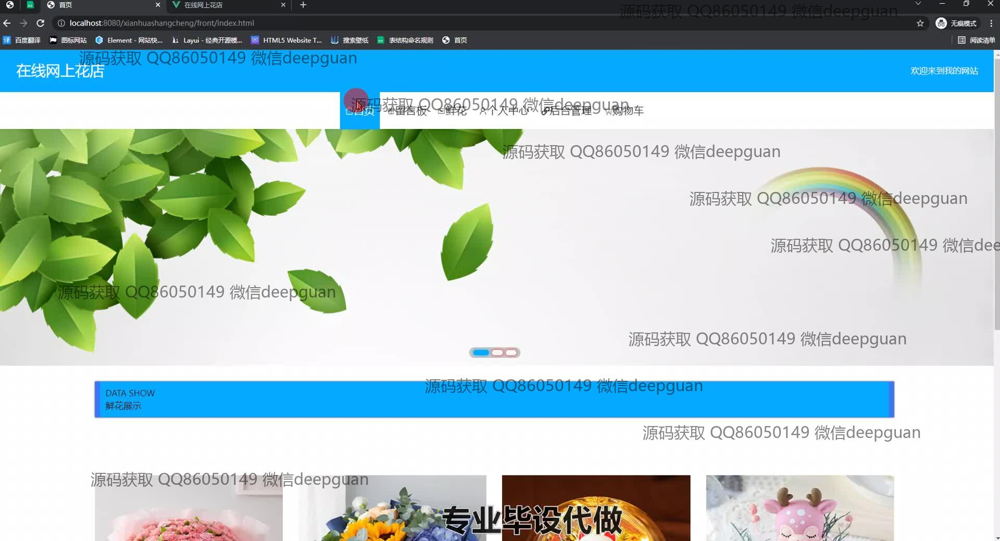
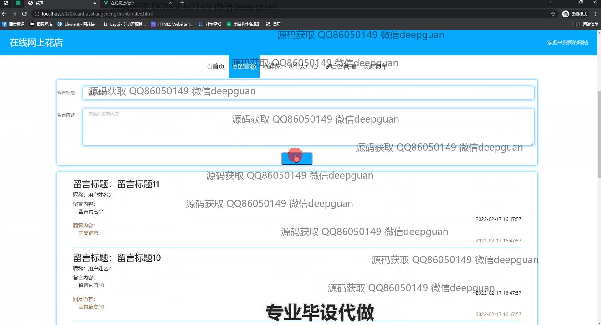
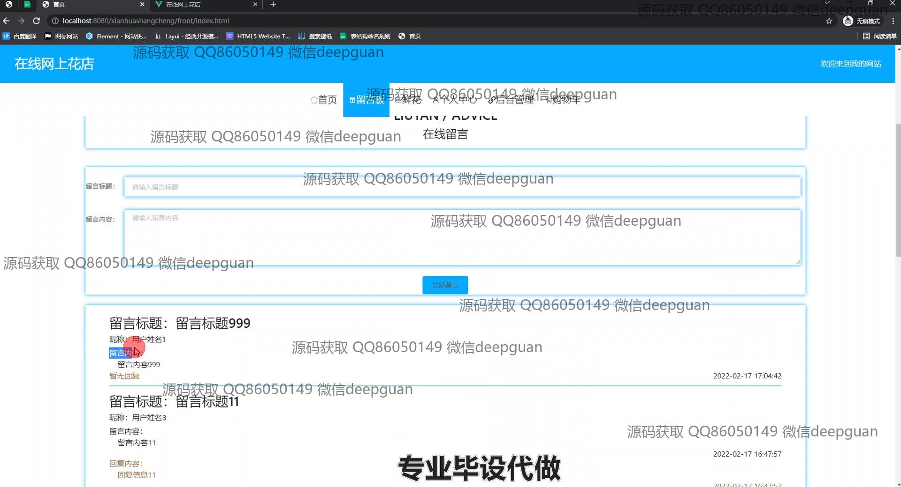
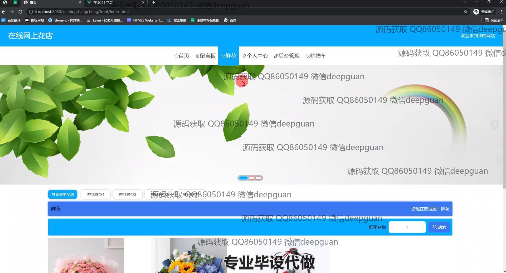
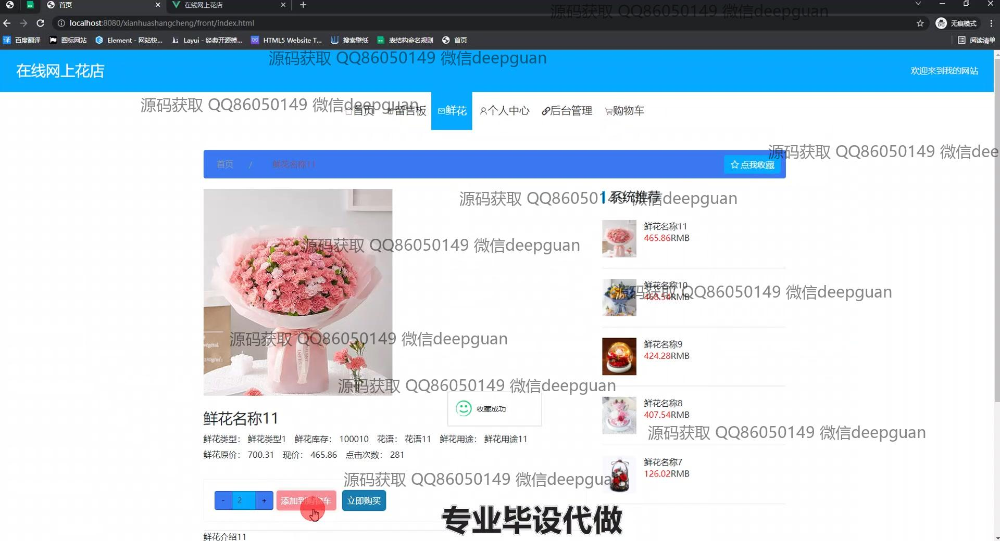
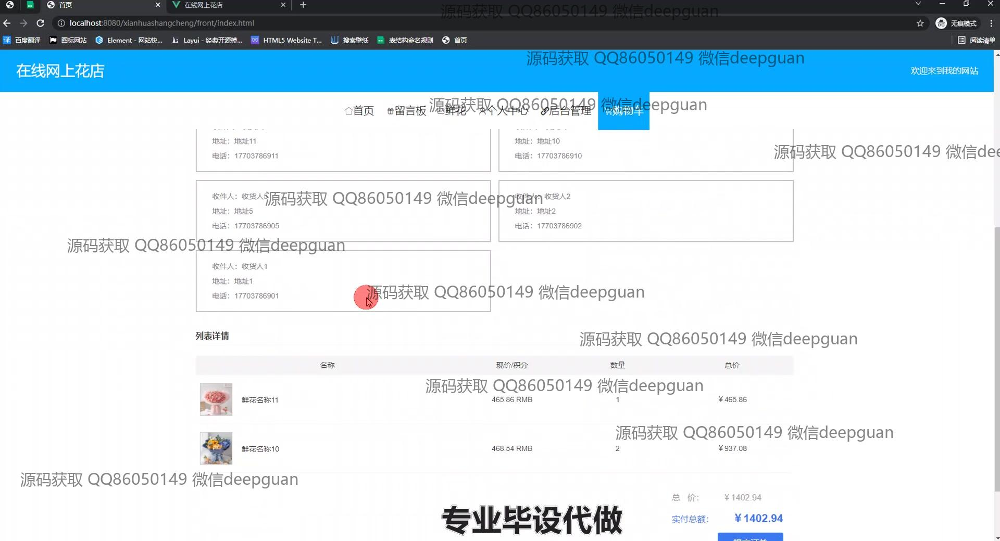
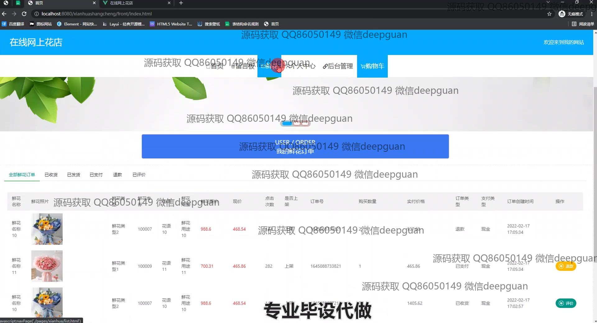
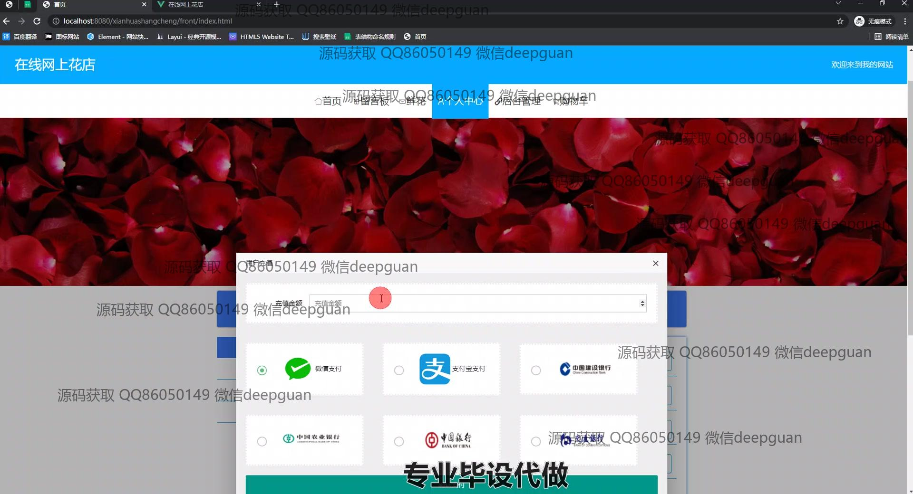

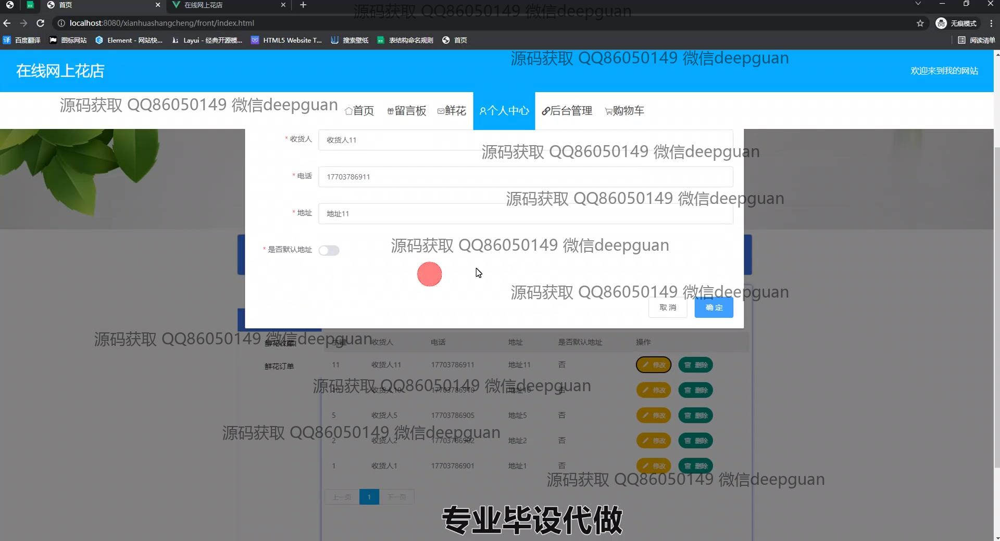
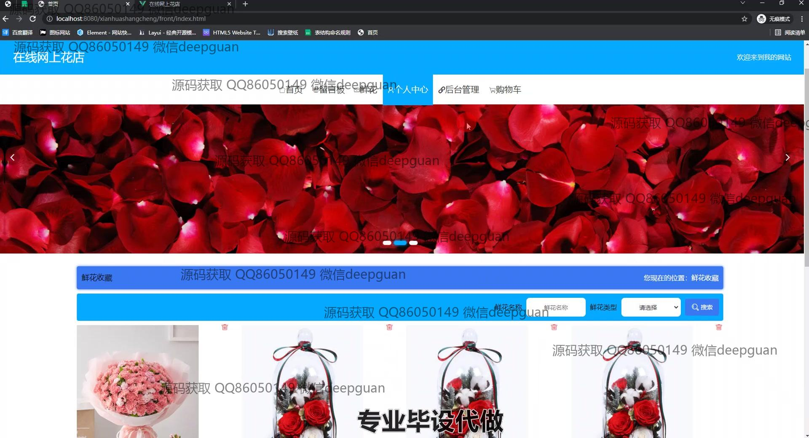
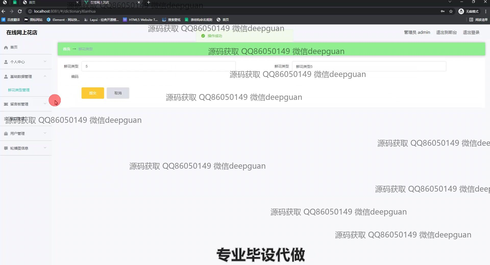
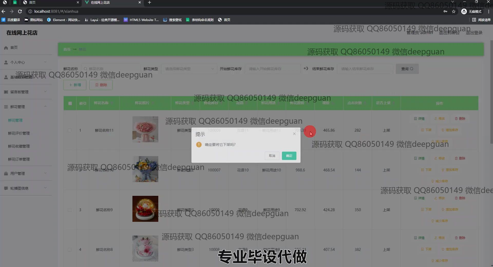
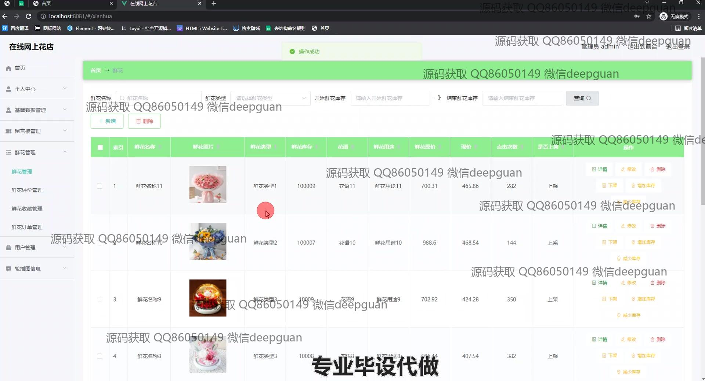
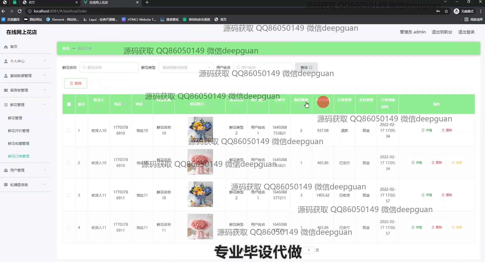
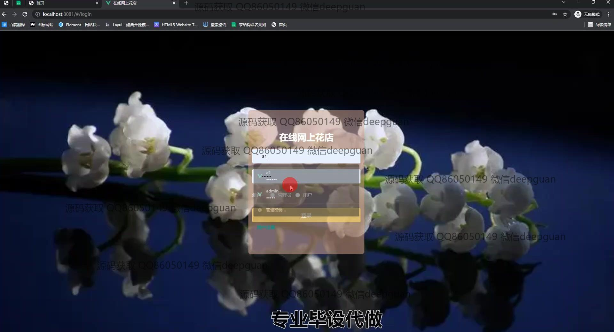
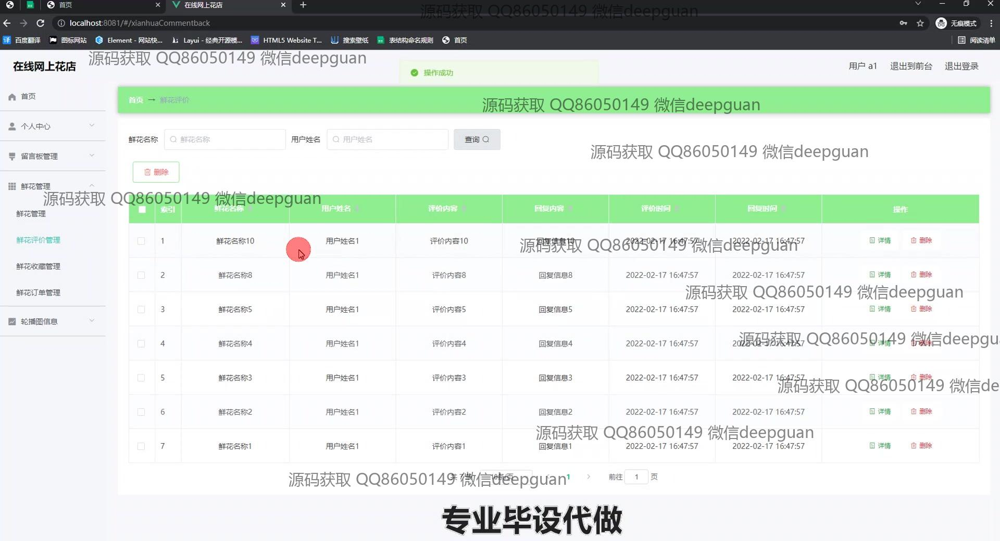
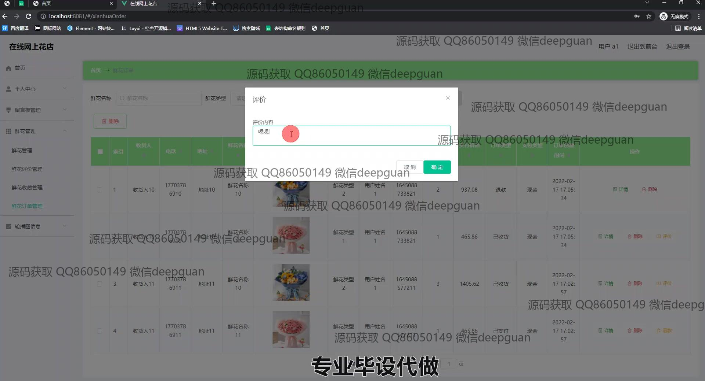
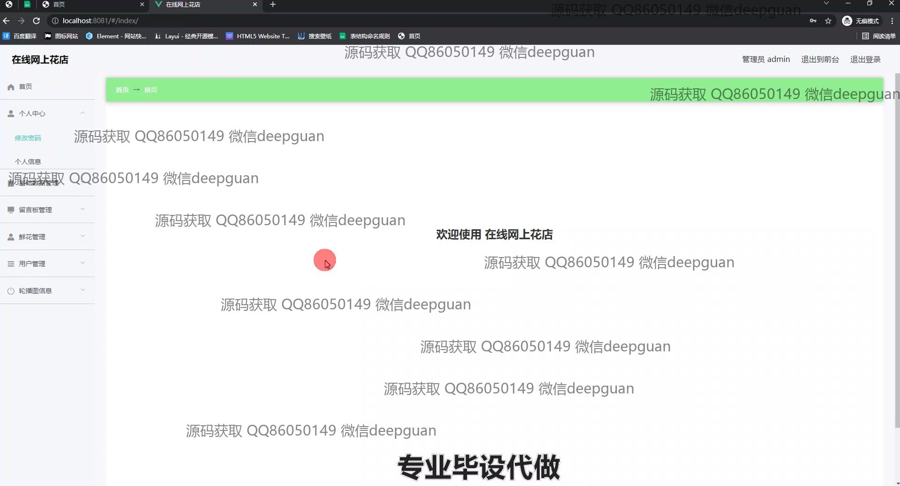
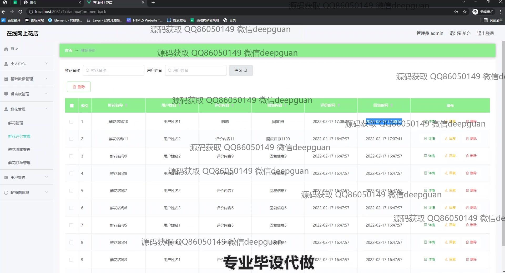

本代码来源于网络,仅供学习参考使用!

